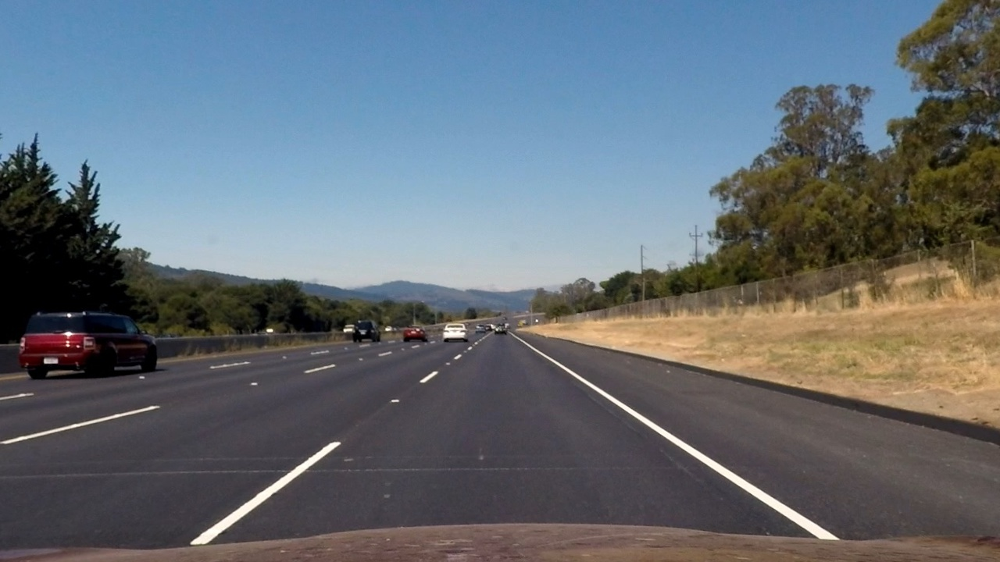

## Advanced Lane Finding

Overview
---

In this project, our goal is to write a software pipeline that can identify the lane boundaries in a video. Before delving into finding the boundaries, we first try to calibrate the camera based on chess board images so that we can undistort camera images. After that we will talk about Lane Line finding.

Pipeline
---
*The pipeline along with the corresponding python codes will be described here.*

*Note: I have not included the all video data in my submission, because my github repository has limited space. However, I included the output video file.*

 

I. Compute the camera calibration matrix and distortion coefficients given a set of chessboard images.

* A set of chess board images from camera are given. Open cv libraray `cv2.findChessboardCorners` and `cv2.calibrateCamera` are used for this part. which results in `mtx` and `ret` for computing undistorted version of the images.

* Given `mtx` and `ret` matrices, opencv `cv2.undistort` is used for getting the undisrted image. An example of the original and undistorted image is shown down here.

 

 

 

II. Distortion matrices `mtx` and `ret` will be applied to all images before further processings. The following two images show an example of the original(left) and undistorted(right) image.

	

 

 

III.

 

 

IV.

 

 

V.

 

 

VI.

 

 

VII.

 

 

VIII.

 
