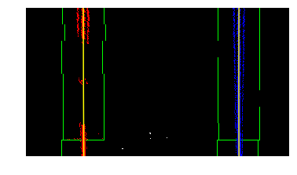

## Advanced Lane Finding

Overview
---

In this project, our goal is to write a software pipeline that can identify the lane boundaries in a video. Before delving into finding the boundaries, we first try to calibrate the camera based on chess board images so that we can undistort camera images. After that we will talk about Lane Line finding.

Pipeline
---
*The pipeline along with the corresponding python codes will be described here.*

*Note: I have not included the all video data in my submission, because my github repository has limited space. However, I included the output video file.*

 

I. Compute the camera calibration matrix and distortion coefficients given a set of chessboard images.

* A set of chess board images from camera are given. Open cv libraray `cv2.findChessboardCorners` and `cv2.calibrateCamera` are used for this part. which results in `mtx` and `ret` for computing undistorted version of the images.

* Given `mtx` and `ret` matrices, opencv `cv2.undistort` is used for getting the undisrted image. An example of the original and undistorted image is shown down here.

 

 

 

II. Distortion matrices `mtx` and `ret` will be applied to all images before further processings. The following two images show an example of the original(left) and undistorted(right) image.

	

 

 

III. Using color transforms, gradients, etc., to create a thresholded binary image

* Open cv package `cv2.Sobel` is used in order to create Thresholded Binary Images. 
* We used five different type of threshold that four of them are based on `cv2.Sobel` and one of them is based on color channel.
* `cv2.Sobel` is used to apply threshold in `x`, `y`, `magnitud`, and `angles`.
* `RGB` images are first converted to `hls` format and then `s` is used for color thresholding.
* All of these threshold are applied to a sample image and the result will become a binary thresholded images as the following image.

 

 

 

IV. Generating "Bird Eye View" of images

* We used perspective transform in order to change images into "Bird Eye View".
* In order to transform images into "Bird Eye View", we first used opencv `cv2.getPerspectiveTransform` library in order to get transformation matrices.
* Having a sample source and destination image can help us to get these transforms because we can pick corresponding points in source and destination images and map them together by `cv2.getPerspectiveTransform`.
* Having a sample images we these points as our source and destination points. `src = [[581, 477],[699, 477],[896, 675],[384, 675]]` and `dst = [[384, 0],[896, 0],[896, 720],[384, 720]]`

* Applying `M = cv2.getPerspectiveTransform(src, dst)` will give us transformation matrix `M`.

* Finally we used the undistorted image along with opencv `cv2.warpPerspective` library and `M` in order to get the WARPED image.

* The result on the previous image is shown down here.

 

 

 

V. Detecting lane pixels and fit to find the lane boundary.

* Having the warped image we can now use histogram method in order to find the lines.

* Histogram method finds the region that has maximum number of non-zero pixels in the warped binary image. 

* Once we have the region, we use numpy `np.polyfit` function in order to fit a second order function to the found lines.

* The result for this part will be as follow. As you can see red line corresponds to the left lane and blue corresponds to the right lane.

 

 

 

VI. In order to know how much the autonomous system has to steer the wheel it is necessary to know the curvature of the lane lines.

* We used  and  `3.7/700` as `30/720` the measurement of distances in the `x` and `y` direction.
* having these numbers and points from previous fit we can measure curvature of the lane lines.

 

 

VII. Warp the detected lane boundaries back onto the original image.

* Now the we know the boundaries of the lane lines, we can warp back by using inverse of the perspective transform matrix. Again opencv `cv2.warpPerspective` for warping back the found boundary to the original image.

 

 

 

VIII.

 
